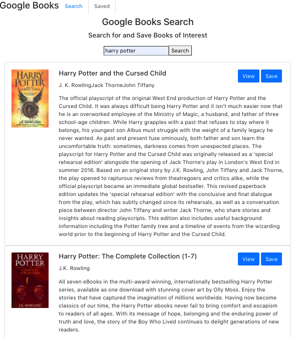

## Description

A React-based Google Books Search app that lets users search, save and delete books. 

Technologies used:

1. React
2. Node
3. Express 
4. MongoDB

This application has 2 pages:

* Search: User can search for books via the Google Books API and render them here. User has the option to "View" a book, bringing them to the book on Google Books, or "Save" a book, saving it to the Mongo database. 

* Saved: Renders all books saved to the Mongo database. User has an option to "View" a book, bringing them to the book on Google Books, or "Delete" a book, removing it from the Mongo database. 

## License

[No Image Photo](https://depositphotos.com/vector-images/no-image-available.html)

[Google Book API](https://developers.google.com/books)

## Links

[Application](https://kn-googlebooks.herokuapp.com/)

[My LinkedIn](https://www.linkedin.com/in/katherine-nguyen-205a7b13a/)

